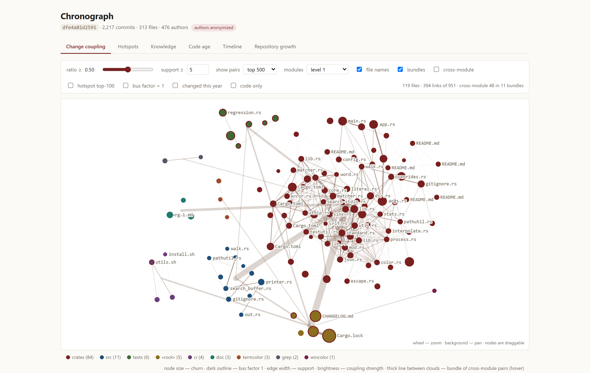
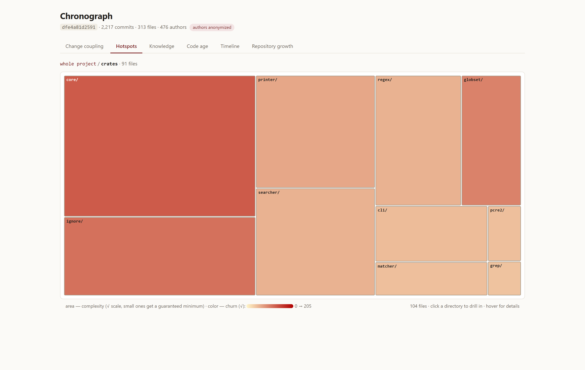
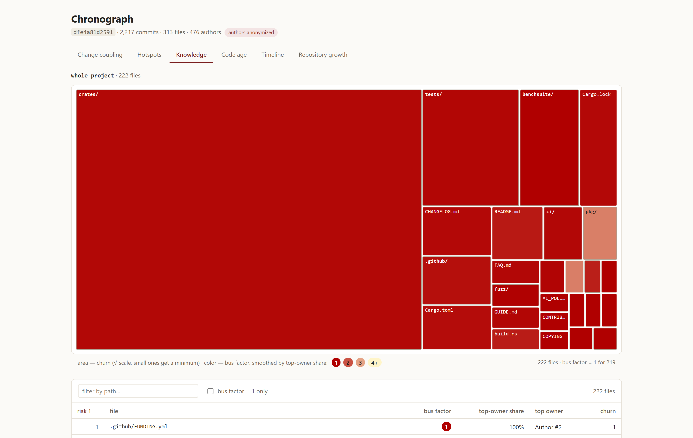
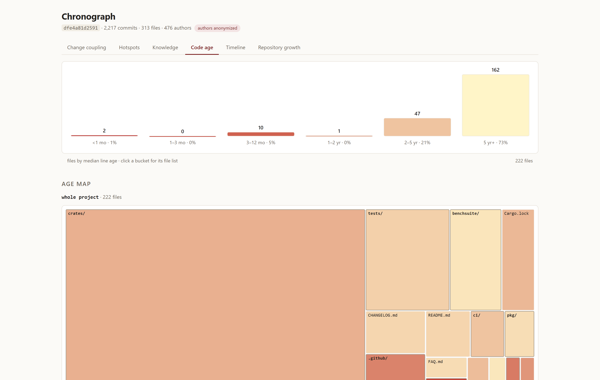
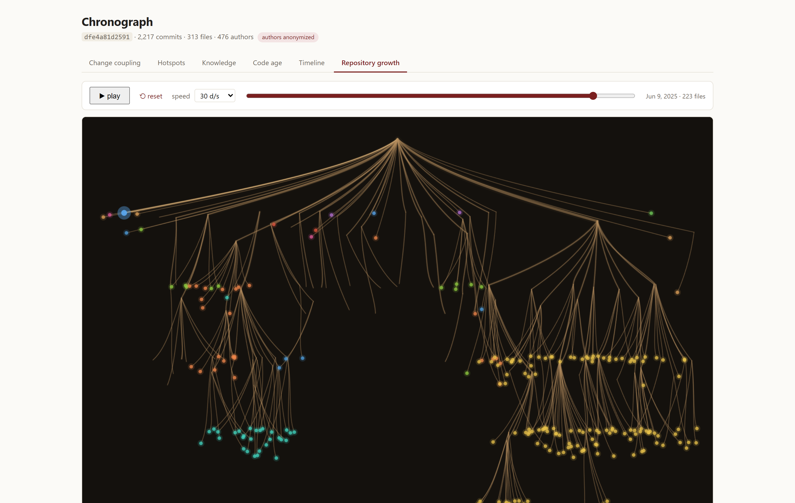

<div align="center">

# Chronograph

**Git repository evolution analytics.**

Turn a repository's history into three actionable signals — **hotspots**, **change coupling**, and a **knowledge map / bus factor** — plus code‑age and an animated repository‑growth view.

[](https://github.com/Nonaqe/Chronograph/actions/workflows/ci.yml)
[](Cargo.toml)
[](LICENSE)

**English** · [Русский](README.ru.md)

</div>

---

Chronograph is a source‑available engine that reads a git history and computes, deterministically, *where* a codebase is risky and *how* it got that way — without ever scoring individual developers. The core is written in Rust (library + CLI); the primary distribution channel is a **GitHub Action** that produces a single self‑contained HTML report; an optional **web UI** turns the same data into interactive visualizations.

<div align="center">

<br><em>Change coupling — files that change together, laid out as an interactive force graph.</em>
</div>

## Why

Most code‑quality tools tell you what a file looks like *right now*. Chronograph tells you what a file's **history** says about it:

- A file with high **churn** and high **complexity** is a *hotspot* — the code you touch constantly and understand least.
- Files that keep changing together (**change coupling**) reveal hidden architectural dependencies that imports don't show.
- A file that only one person has ever meaningfully edited (**bus factor 1**) is a knowledge‑concentration risk.

These signals correlate with real defects and real maintenance pain, and none of them require you to rank people.

## The signals at a glance

| Signal | Question it answers | Visualization |
|---|---|---|
| **Hotspots** | Which files are both changed‑often and complex? | Zoomable treemap |
| **Change coupling** | Which files change together but live apart? | Force graph |
| **Knowledge / bus factor** | Where is knowledge dangerously concentrated? | Risk treemap + table |
| **Code age** | Which code is churning vs. stable? | Histogram + age map |
| **Timeline** | What did the tree look like at any past moment? | Scrubber + snapshot |
| **Repository growth** | How did the project grow over time? | Animated "roots" |

<table>
<tr>
<td width="50%"><br><em>Hotspots — area = complexity, color = churn.</em></td>
<td width="50%"><br><em>Knowledge — color = bus factor, table ranks risk.</em></td>
</tr>
<tr>
<td width="50%"><br><em>Code age — line age distribution per file.</em></td>
<td width="50%"><br><em>Repository growth — the tree grows over time.</em></td>
</tr>
</table>

## Quick start

### 1. Build the CLI

```bash
git clone https://github.com/Nonaqe/Chronograph.git
cd Chronograph
cargo build --release
# binary at target/release/chronograph
```

> The first build compiles a bundled DuckDB from source (a few minutes on a cold cache). Later builds are incremental.

### 2. Analyze a repository

```bash
# top hotspots
chronograph hotspots /path/to/repo

# files that change together
chronograph coupling /path/to/repo --min-support 5

# knowledge concentration (authors anonymized by default)
chronograph knowledge /path/to/repo

# self-contained HTML report
chronograph report /path/to/repo --out report.html
```

### 3. (Optional) Explore in the browser

```bash
# produce the deterministic JSON export
chronograph export /path/to/repo --out chronograph.json

# run the web UI and drop chronograph.json onto it
cd web && npm install && npm run dev   # http://localhost:5173
```

## Use it in CI (GitHub Action)

Add a workflow that generates an HTML report on every push and uploads it as an artifact:

```yaml
name: chronograph
on: [push]
jobs:
  report:
    runs-on: ubuntu-latest
    steps:
      - uses: actions/checkout@v4
        with:
          fetch-depth: 0            # full git history is required
      - uses: Nonaqe/Chronograph/action@v0.1.0
        with:
          path: .
          output: chronograph-report.html
```

The Action downloads a prebuilt binary, verifies its SHA‑256, runs `chronograph report`, and uploads the result. See **[GitHub Action docs](docs/en/github-action.md)**.

## Documentation

| Guide | What's inside |
|---|---|
| [Installation](docs/en/installation.md) | Build from source, requirements, running the binary |
| [CLI reference](docs/en/cli.md) | Every command and flag, with example output |
| [Metrics explained](docs/en/metrics.md) | Exact definitions and formulas for every signal |
| [GitHub Action](docs/en/github-action.md) | Inputs, workflow examples, GitHub Pages |
| [HTML report](docs/en/html-report.md) | What the self-contained report contains |
| [Web UI](docs/en/web-ui.md) | The six interactive tabs, with screenshots |
| [JSON export](docs/en/json-export.md) | The `chronograph.json` schema (v1) |
| [Architecture](docs/en/architecture.md) | Crates, data flow, DuckDB schema, determinism |
| [Configuration](docs/en/configuration.md) | Thresholds, exclusions, blame budget |
| [FAQ & troubleshooting](docs/en/faq.md) | Common issues, privacy, anti‑goals |

## Design principles

1. **Signal before beauty.** Every capability is useful from the CLI with no graphics. The animation is the *last* feature, not the first.
2. **Metrics are about files and modules, not people.** The knowledge map is presented only as a *concentration risk* (bus factor), with anonymization on by default.
3. **No magic "health score 0–100".** Only transparent components with documented definitions; aggregates are always decomposable.
4. **Determinism is mandatory.** Same repo + same config → byte‑identical output. All timestamps are UTC. Engine version and config hash are written into every report.
5. **Performance is a requirement, not an afterthought.** Incremental analysis is built in: only new commits are processed on re‑runs.

## What Chronograph is **not**

- ❌ Individual developer productivity scoring
- ❌ Manager DORA metrics
- ❌ A real‑time linter
- ❌ "Support every language at once" — at launch: JS/TS, Python, Go, Rust
- ❌ ML defect prediction

## Tech stack

**gix** (gitoxide) for git access · **tree‑sitter** for AST‑based complexity · **DuckDB** (bundled) for columnar analytics · **clap** for the CLI · **rayon** for parallelism · **React + D3** for the web UI.

## License

Licensed under the **[PolyForm Noncommercial License 1.0.0](LICENSE)**.

In plain terms: you may **use, copy, modify, share, and fork Chronograph for free for any noncommercial purpose** — personal projects, study, research, hobby, education, and non‑profit/government use — as long as you keep the `Required Notice` (author attribution) with any copies you distribute. **Commercial use / monetization requires a separate license** from the author. The software is provided "as is", without warranty.

> This is a *source‑available* license, not an OSI‑approved open‑source license (it restricts commercial use). See the [full text](LICENSE).

---

<div align="center">
<sub>Built with Rust · <a href="docs/en/architecture.md">architecture</a> · <a href="README.ru.md">Русская версия</a></sub>
</div>
