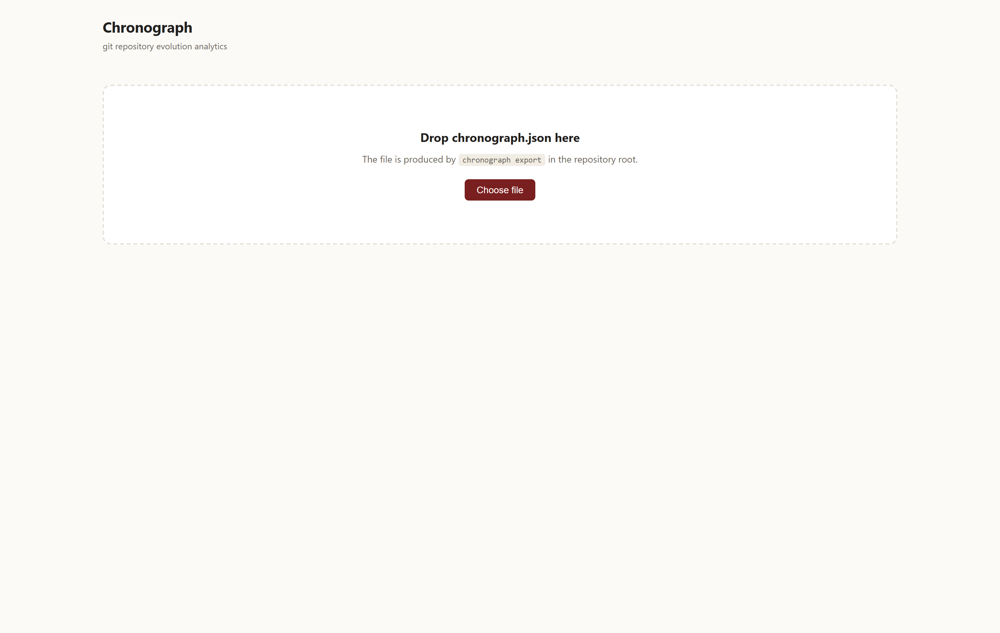
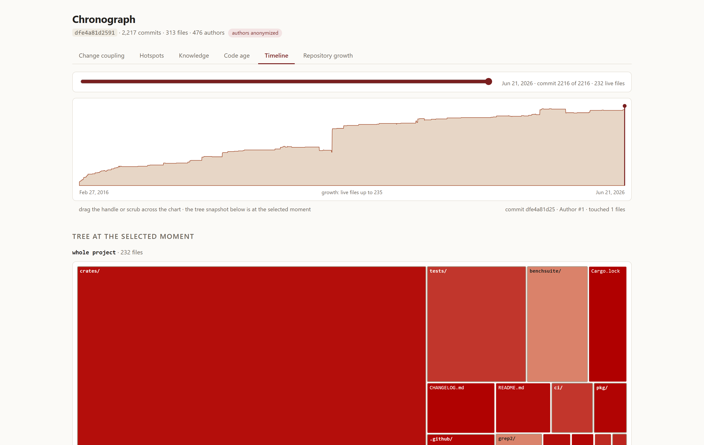

# Web UI

[← Оглавление](README.md) · [English](../en/web-ui.md)

Web UI — опциональный интерактивный клиент на **React + TypeScript + Vite**, с визуализациями, вручную сделанными на **D3**. Все зависимости бандлятся — ноль CDN. Он читает `chronograph.json`, созданный командой [`chronograph export`](cli.md#export).

## Запуск

```bash
cd web
npm install
npm run dev        # dev-сервер на http://localhost:5173
npm run build      # статика в web/dist/
```

## Загрузка данных

Создайте экспорт и передайте его в UI:

```bash
chronograph export /путь/к/репо --out chronograph.json
```

- **Перетащите** файл `chronograph.json` в зону сброса (или нажмите **Choose file**).
- При отдаче по HTTP можно автозагрузить через `?src=<url>` — например `http://localhost:5173/?src=/data/ripgrep.json` (положив файл в `web/public/data/`, каталог в .gitignore).

<div align="center">

<br><em>Стартовый экран: перетащите <code>chronograph.json</code>, чтобы начать.</em>
</div>

После загрузки в шапке показываются head SHA, счётчики коммитов/файлов/авторов и бейдж **«authors anonymized»**, когда имена скрыты.

## Шесть вкладок

### 1. Change coupling

D3 force‑граф файлов, меняющихся вместе. Размер узла = churn, тёмный контур = bus factor 1, толщина ребра = support, яркость ребра = сила сцепления. Узлы окрашены по верхней директории и сгруппированы в модульные «пучки». Богатая панель фильтров («карта рисков») позволяет отсекать по ratio и support, показывать топ‑N пар, переключать уровни модулей и включать оверлеи (hotspot top‑100, bus factor = 1, изменённые в этом году, только код, только cross‑module).

<div align="center">

</div>

### 2. Hotspots

Zoomable treemap (d3‑hierarchy). Площадь = сложность (√‑шкала, чтобы мелкие файлы оставались видимы), цвет = churn. Клик по директории проваливается внутрь; хлебные крошки отслеживают глубину; hover — детали по ячейке.

<div align="center">

<br><em>Провалились в <code>crates/</code>: <code>core/</code> — самый красный (наибольший churn).</em>
</div>

### 3. Knowledge

Treemap, где площадь = churn, цвет = bus factor (сглажен долей топ‑владельца), плюс сортируемая таблица риска (bus factor, доля топ‑владельца, топ‑владелец, churn). Фильтр по пути или показ только файлов с bus factor 1.

<div align="center">

</div>

### 4. Code age

Гистограмма файлов по бакетам медианного возраста строк (`<1 мес`, `1–3 мес`, `3–12 мес`, `1–2 г`, `2–5 л`, `5 л+`) плюс treemap «карта возраста». Клик по бакету показывает список его файлов.

<div align="center">

</div>

### 5. Timeline

Ползунок по всей истории с графиком роста числа живых файлов. Потяните ручку в любой момент — treemap ниже покажет дерево файлов **таким, каким оно было** на том коммите.

<div align="center">

</div>

### 6. Repository growth

Витринная фича (и, по замыслу, *последняя* сделанная): Gource‑style анимация «прорастающих корней». Дерево файлов/директорий раскрывается радиально во времени — ветви утолщаются с числом файлов в поддереве, файлы‑«почки» распускаются и вспыхивают, когда их касается коммит. Цвета кодируют верхние директории; **авторы не показываются** (принцип: файлы, не люди). Play, pause, reset, регулировка скорости или прокрутка.

<div align="center">

</div>

## Принципы

- **Детерминизм к UI не относится.** Гарантия байт‑идентичности — про артефакт `chronograph.json`, а не про живой рендер; анимация роста/timeline использует физику и время и намеренно не воспроизводима пиксель‑в‑пиксель.
- **Контролы — презентационные фильтры, не пороги метрик.** Слайдеры ratio/support/топ‑N меняют то, что *показано*; сами числа уже посчитаны движком.
- **Анонимизация уважается.** Движок анонимизирует авторов по умолчанию; UI просто показывает то, что в файле.
